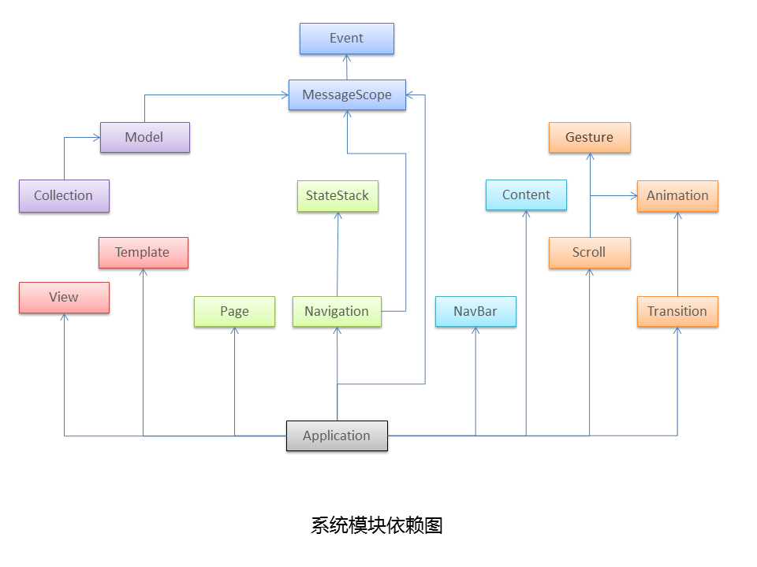

# API手册（v0.4.x）

## 索引

- [app](#app)
- [app.config](#appconfig)
- [app.navigation](#appnavigation)
- [app.scroll](#appscroll)
- [app.module.Animation](#appmoduleanimation)
- [app.module.Collection](#appmoduleccollection)
- [app.module.Content](#appmodulecontent)
- [app.module.Event](#appmoduleevent)
- [app.module.MessageScope](#appmodulemessageScope)
- [app.module.Model](#appmodulemodel)
- [app.module.Navbar](#appmodulenavbar)
- [app.module.Navigation](#appmodulenavigation)
- [app.module.Page](#appmodulepage)
- [app.module.Scroll](#appmodulescroll)
- [app.module.StateStack](#appmodulestateStack)
- [app.module.Template](#appmoduletemplate)
- [app.module.Toolbar](#appmoduletoolbar)
- [app.module.Transition](#appmoduletransition)
- [app.module.View](#appmoduleview)

##app

### start(config)

* @param {object} [config]

启动App。config的字段同`app.config`

### setTemplate(id, tpl)

* @param {string} id
* @param {string|function} tpl

设置模板

### extendView(properties)

* @param {object} properties
* @return {Class} a child class of View

扩展视图

### getView(name)

* @param {string} name
* @return {View} an instance of View

获得名为name的视图实例

### definePage(properties)

* @param {object} properties
* @return {Page} an instance of Page

定义页面

### definePageMeta(properties)

* @param {object} properties

定义页面元数据

### getPage(name)

* @param {string} name
* @return {Page} an instance of Page

获得名为name的页面实例

### loadResource(urls, type, callback)

* @param {string|array} urls
* @param {string} type - `js/css`
* @param {function} callback

依次加载urls中的资源（JS/CSS）文件，完成后调用callback。

##app.config

### viewport

* @var {HTMLElement}

设置视觉区域节点，默认为class是`viewport`的HTMLElement或者`document.body`。

### enableMessageLog

* @var {boolean}
 
设置在控制台输出消息日志，默认为`false`

### enableContent

* @var {boolean|object}

设置页面内容区域节点，默认为class是`content`的HTMLElement或者和视觉区域节点相同。

当设置成object时，有以下字段：

	wrapEl: 视觉区域节点
	cacheLength: 缓存页面内容的长度，默认为5

### enableNavbar

* @var {boolean|object}

设置是否启用导航栏，默认为`false`。

当设置成object时，有以下字段：

	wrapEl: 导航栏节点，默认为class是`navbar`的HTMLElement。

### enableToolbar

* @var {boolean|object}

设置是否启用工具栏，默认为false。

当设置成object时，有以下字段：

	wrapEl: 工具栏节点，默认为class是`toolbar`的HTMLElement。

### enableScroll

* @var {boolean}

设置是否启用页内滚动，默认为false

### enableTransition

* @var {boolean}

设置是否启用转场效果，默认为false

### templateEngine

* @var {object}

定义模版引擎的load、compile和render代理方法：

**load(url, callback)**

* @param {string} url
* @param {function} callback

该代理方法，需要通过callback的回调传递模板文本

**compile(text)**

* @param {string} url
* @return {function} a compiled function

该代理方法，需要返回一个被编译过后的函数

**render(compiled, datas)**

* @param {function} a compiled function
* @param {object} a set of data
* @return {string} a rendered result

该代理方法，需要返回渲染后的结果

##app.navigation

### push(fragment, options)

* @param {string} fragment
* @param {object} [options]

（导航）前进操作。fragment指定Hash片段，`options`参数的字段包括：

	transition: 转场动画，backward/forward
	type: 传递参数的类型，GET/POST
	data: 参数键值对

### pop()

（导航）后退操作。

### resolveFragment(name, params)

* @param {string} name
* @param {object} params
* @return {string} a hash fragment

返回处理后的Hash片段。例如有个名为`index`的路由，其正则表达式为`index/(P<name>\w+)`，那么resolveFragment('index', {name:'test'})的返回值为`index/test`。

### getReferer()

* @return {string} a referer

获得上一个页面的地址。

### getParameter(name)

* @param {string} name
* @return {string} a value

获取路由中名为name的参数值以及通过GET/POST传递过来的名为name的参数值。

### getParemters()

* @return {object} a set of values

获取所有参数键值对。

### setData(name, value)

* @param {string} name
* @param {*} value

设置GET/POST的参数值。

### setTitle(title)

* @param {string} title

设置标题的内容。支持HTML片段。

### setButton(options)

* @param {object} options

设置导航栏的按钮，options参数的字段包括：

	id: 按钮的id
	class: 按钮的class
	text: 按钮的文本
	bg: 按钮的背景样式（style.background）
	icon: 按钮的图标（button中设置img标签）
	hide: 是否隐藏
	handler: 按钮点击的句柄

### setToolbar(options)

* @param {object} options

设置工具栏，options参数的字段包括：

	html: 插入到工具栏的HTML片段
	el: 插入到工具栏中的DOM节点
	height: 工具栏的高度

##app.scroll

### getScrollHeight()

* @return {Number} height

获取页面区域的滚动高度。

### getScrollTop()

* @return {Number} height

获取页面区域的滚动位置。

### refresh()

刷新页面区域。

### offset(el)

* @param {HTMLElement} element
* @return {object} a rectangle object

返回页面区域内某元素的矩阵数据，包括`top/bottom/width/height/left/right`。

### scrollTo(y)

* @param {Number} y value

滚动到页面中的某位置。

### scrollToElement(el)

* @param {HTMLElement} element

滚动到页面中的某元素。

### getBoundaryOffset()

* @return {object} a offset object

获取页面区域回弹时的偏移值。

### getViewHeight()

* @return {Number} height

获得页面区域的可见高度。

### stopBounce()

出现回弹时，停止回弹。

### resumeBounce()

恢复回弹。

### addEventListener(name, handler, isBubble)

* @param {string} a event name
* @param {function} a event handler
* @param {boolean} if bubble

绑定事件。

### removeEventListener(name, handler)

* @param {string} a event name
* @param {function} a event handler

解绑事件。

### 可监听的事件

**scrollstart**

滚动开始（只在enableScroll=true时有效）

**scrollend**

滚动结束

**pulldown**

上边界下拉（只在enableScroll=true时有效）

**pullup**

下边界上拉（只在enableScroll=true时有效）

**bouncestart**

边界回弹开始（只在enableScroll=true时有效）

**bounceend**

边界回弹结束（只在enableScroll=true时有效）

## app.module.Animation

提供调用Transition动画。

### Animation.doTransition(element, properties, options)

* @param {HTMLElement} a element
* @param {object} the element's properties
* @param {object} the transition's options

让一个HTML元素执行transition动画。`properties`是元素的样式集，支持`transform`的属性。`options`是`transition`的参数（duration，timingFunction，delay以及callback）。

	Animation.doTransition(body, {
		backgroundColor: 'red',
		translate:[100, 100]
	}, {
		duration: '0.4s',
		timingFunction: 'ease',
		callback: transitionEnd 
	})

### Animation.translate(element, duration, timingFunction, delay, x, y, callback)

* @param {HTMLElement} a element
* @param {string} the duration of movement
* @param {string} the timingFunction of movement
* @param {string} the delay of movement
* @param {number} the x of coordinate
* @param {number} the y of coordinate
* @param {function} a callback function

让一个HTML元素进行平移动画。

### Animation.genCubicBezier(a, b)

* @param {number} a 
* @param {number} b
* @return a array

生成贝塞尔函数。

### Animation.makeTranslateString(x, y)

* @param {number} the x of coordinate
* @param {number} the y of coordinate
* @return a string

返回`translate`的字符串。

### Animation.getTransformOffset(element)

* @param {HTMLElement}
* @return a x/y object

返回HTML元素的平移位置（X/Y）

## app.module.Collection

提供集合的数据模型，并可以监听数据的更新。

### new Collection(arrayData)

* @param {array} arrayData
* @param {Collection} a collection object

实例化一个集合对象。

### length

* @var {number} the length of collection

集合模型的值长度（只读）。

### pop()

* @return {*} value

从集合模型的栈顶弹出一个值。

### push(value)

* @param {*}  value

往集合模型的栈顶压入一个值。

### 来自于MessageScope的方法

	- on
	- off
	- trigger
	- once
	- after

### 可监听的事件

**propertyChange**

	collection.on('propertyChange', function handler(e) {});

**change:index**

	collcation.on('chnage:1', function handler(value) {});

## app.module.Content

UI模块。提供多个节点的缓存机制。

### new Content(wrapEl, options)

* @param {HTMLElement} wrapEl
* @param {object} [options]

实例化一个Content对象。options可配置的参数如下：

	- cacheLength: 节点缓存数量，默认为1。

### setClassName()

设置当前状态下DOM节点的class。

### getActive()

* @return {HTMLElement} the current active node

返回当前激活状态的节点。

### getNext()

* @return {HTMLElement} the next node

返回当前激活节点的下一个节点。

### getPrevious()

* @return {HTMLElement} the previous node

返回当前激活节点的上一个节点。

### next()

激活下一个节点。

### previous()

激活上一个节点。

### html(str)

* @param {string} a html string

设置当前激活节点的HTML。

## app.module.Event

提供发布/订阅者模式的模型。

### new Event()

* @return {Event} a event object

返回Event的对象。

### addEventListener(type, handler)

* @param {string} a event type
* @param {function} a event handler

监听事件。

### removeEventListener(type, handler)

* @param {string} a event type
* @param {function} a event handler

取消监听事件。

### dispatchEvent(e)

* @param {object} a event object

分发一个事件。`e`对象必须包含字段`type`。

## app.module.MessageScope

提供消息模型。

### new MessageScope(scope)

* @param {string} a scope name
* @return {MessageScope} a MessageScope object

返回一个消息对象。scope为消息的作用域名称。 

### on(events, callback, context)

* @param {string} a name list of event
* @param {function} a callback function
* @param {object} [a context for callback]

开启事件监听。events支持两种种格式：

1. event1 - 只监听一个事件。
2. event1 event2 - 以空格分割，表示同时监听多个事件。当其中一个事件触发了，就触发callback。

### off(events, callback, context)

* @param {string} a name list of event
* @param {function} [a callback function]
* @param {object} [a context for callback]

关闭事件监听。

### once(events, callback, context)

* @param {string} a name list of event
* @param {function} a callback function
* @param {object} [a context for callback]

开启监听事件。在事件第一次触发后，关闭监听。

### after(events, callback, context)

* @param {string} a name list of event
* @param {function} a callback function
* @param {object} [a context for callback]

开启监听事件。当所有事件都触发后，触发callback。

### trigger(events)

* @param {string} events

触发事件。`events`之后的参数会被带入到被触发的callback中。

### MessageScope.mixto(obj, scope)

* @param {object} a object
* @param {string|MessageScope} a scope name or a MessageScope object

在一个对象中混入MessageScope的方法。

### MessageScope.get(scope)

* @param {string} a scope name

获得一个scope作用域的消息对象。

## app.module.Model

提供数据模型。并可以监听数据的变更。

### new Model(data)

* @param {object} a data
* @return {Model} a Model object

返回一个模型对象。

### addProperty(key, value)

* @param {string|number} key
* @param {*} value

给模型新增属性和值。

### update(data)

* @param {object} a data

用data对象来更新模型的属性和值（包括新增属性和值）。

### destory()

销毁模型对象。

### 来自于MessageScope的方法

	- on
	- off
	- trigger
	- once
	- after

### 可监听的事件

**propertyChange**

	model.on('propertyChange', function handler(e) {});

**change:name**

	model.on('chnage:a.b.c', function handler(value) {});

## app.module.Navbar

UI模块。提供对导航栏的操作。

### new Navbar(wrapEl)

实例化一个Navbar对象。

### setTitle(title)

* @param {string} a title

设置导航栏的标题。

### setButton(options)

* @param {object} the options of button

设置导航栏上的按钮。

### getButton(id) 

* @param {string} the id of a button
* @return {HTMLElement} a button

获得导航栏上的某个按钮

### removeButton(id)

* @param {string} [the id of a button]

移除导航栏上的某个按钮。如果不提供`id`参数，则移除所有导航栏右侧的按钮。

## app.module.Navigation

提供导航前进/后退等操作。

### new Navigation()

* @return {Navigation} a Navigation object

返回一个Navigation对象。

### getStack()

* @return {StateStack} a StateStack object

返回绑定的StateStack对象。

### addRoute(name, routeText, options)

* @param {string} the route's name
* @param {string} the route's text
* @param {object} options

添加一个路由规则。options参数的字段包括：

	- default: 是否为默认路由，默认为false
	- last: 是否是最后一条规则，默认为true
	- callback: 匹配到路由的回调函数

### removeRoute(name)

* @param {string} the route's name

移除一个路由规则。

### hasRoute(name)

* @param {string} the ruote's name

判断是否名为name的路由。

### start()

* @return {boolean} true/false

开启路由匹配。

### stop()

关闭路由匹配。

### push(fragment, options)

* @param {string} a hash fragument
* @param {object} [options]

压入一个hash片段。options参数的字段包括：

	- type: GET/POST，默认为GET。
	- data: 需要传递的数据

### pop()

弹出一个hash片段。

### resolve(name, params)

* @param {string} the route's name
* @param {object} a key/value data
* @return {string} a hash fragment

解析出名为name路由的hash片段。

### 来自于MessageScope的方法

	- on
	- off
	- trigger
	- once
	- after

### 可监听的事件

**forward**

导航前进事件

**backward**

导航后退事件

## app.module.Page

提供页面对象。

### ready()

定义Page时被调用。

### startup()

载入Page时被调用。

### teardown()

卸载Page时被调用。

### show(persisted)

* @param {boolean} persisited

显示Page时调用。当Page在缓存中时，`persisited`为`true`。

### hide()

隐藏Page时调用。

### Page.fn

* @var {object}

用于扩展页面对象的方法。

### Page.define(properties)

* @param {object} properties
* @return {Page} a Page object

返回一个页面对象。

### Page.get(name)

* @param {string} the page name

获取一个名为name的页面对象。 

## app.module.Scroll

UI模块。提供对内部滚动的操作。

### Scroll.enable(el, options)

* @param {HTMLElement} a element
* @param {object} [options]

启用HTML元素内的滚动（Y轴）。options参数的字段包括：

	- bounceTop: 顶部回弹的高度
	- bounceBottom: 底部回弹的高度

### Scroll.disable(el)

* @param {HTMLElement} a element

停用HTML元素内的滚动。

### Scroll.getScrollHeight(el)

* @param {HTMLElement} a element
* @return {Number} height

获取HTML元素区域的滚动高度。

### Scroll.getScrollTop(el)

* @param {HTMLElement} a element
* @return {Number} height

获取HTML元素区域的滚动位置。

### Scroll.refresh(el)

* @param {HTMLElement} a element

刷新HTML元素区域。

### Scroll.offset(el, child)

* @param {HTMLElement} a element
* @param {HTMLElement} a child element
* @return {object} a rectangle object

返回HTML元素区域内某元素的矩阵数据，包括`top/bottom/width/height/left/right`。

### Scroll.scrollTo(el, y)

* @param {HTMLElement} a element
* @param {Number} y value

滚动到HTML元素区域中的某位置。

### Scroll.scrollToElement(el, child)

* @param {HTMLElement} a element
* @param {HTMLElement} a child element

滚动到HTML元素区域中的某元素。

### Scroll.getBoundaryOffset(el)

* @param {HTMLElement} a element
* @return {object} a offset object

获取HTML元素区域回弹时的偏移值。

### Scroll.getViewHeight(el)

* @param {HTMLElement} a element
* @return {Number} height

获得HTML元素区域的可见高度。

### Scroll.stopBounce(el)

* @param {HTMLElement} a element

出现回弹时，停止回弹。

### Scroll.resumeBounce(el)

* @param {HTMLElement} a element

恢复回弹。

## app.module.StateStack

提供对状态堆栈的操作。

### new StateStack()

* @return {StateStack} a StateStack object

返回一个状态堆栈的对象。

### reset()

恢复堆栈的初始化状态。

### pushState(name, fragment, params, args)

* @param {string} the state name
* @param {string} a hash fragment
* @param {object} params
* @param {object} args

压入一个状态。

### getState()

* @return {object} the current state object

获取当前状态。

### getIndex()

* @return {number} the current state index

获取当前状态的索引。

### StateStack.isEquals(state1, state2)

* @param {StateStack} state1
* @param {StateStack} state2

比较两个状态是否相等。

## app.module.Template

提供加载、编译、渲染模板的操作。

### new Template()

* @return {Template} a Template object

返回一个模板的对象。

### load(url, callback)

* @param {string} a template url
* @param {function} callback

加载一个模板。完成时调用callback。

### compile(text)

* @param {string} a text
* @return {function} a compiled function

编译一个文本，返回编译后的函数。

### render(datas)

* @param {object} datas
* @return {string} a rendered string

渲染数据，返回渲染后的字符串。

### Template.engine

* @var {object} 模板引擎代理。

默认为不存在load/compile/render的代理方法。

## app.module.Toolbar

UI模块。提供对工具栏的操作。

### new Toolbar(wrapEl, options)

* @param {HTMLElement} a element
* @param {object} [options]
* @return {Toolbar} a Toolbar object

返回一个工具栏的对象。options参数的字段包括：

	- html: 工具栏中的HTML片段
	- el: 工具栏中的节点
	- height: 工具栏的高度

### set(options)

* @param {object} options

设置工具栏的属性。options参数的字段同上。

### show(options)

* @param {object} [options]

显示工具栏。options参数的字段同上。

### hide()

隐藏工具栏。

## app.module.Transition

提供转场动画的操作。

### Transiton.TYPE

* @var {object}

转场动画的滑入滑出类型。包括：

	- LEFT_IN
	- LEFT_OUT
	- RIGHT_IN
	- RIGHT_OUT
	- TOP_IN
	- TOP_OUT
	- BOTTOM_IN
	- BOTTOM_OUT

### Transition.move(element, offsetX, offsetY, callback)

* @param {HTMLElement} element
* @param {number} offsetX
* @param {number} offsetY
* @param {function} [callback]

平移一个元素。

### Transition.slide(element, type, offset, callback)

* @param {HTMLElement} element
* @param {string} type
* @param {number} offset 
* @param {function} [callback]

从边上滑入/滑出一个元素。

### Transition.float(element, type, offset, callback)

* @param {HTMLElement} element
* @param {string} type
* @param {number} offset 
* @param {function} [callback]

飞入/飞出一个元素。

### Transition.fadeIn(element, callback)

* @param {HTMLElement} element
* @param {function} [callback]

淡入一个元素。

### Transition.fadeOut(element, callback)

* @param {HTMLElement} element
* @param {function} [callback]

淡出一个元素。

## app.module.View

提供视图对象。

### render()

渲染视图时被调用。

### destory()

销毁视图时被调用。

### View.fn

* @var {object}

用于扩展视图的方法。

### View.extend(properties)

* @param {object} properties
* @return {View} a child class of View

返回扩展的视图。

### View.get(name)

* @param {string} the view name
* @return {View} a View object

获得一个扩展视图对象的实例。

## 模块依赖关系图

	

