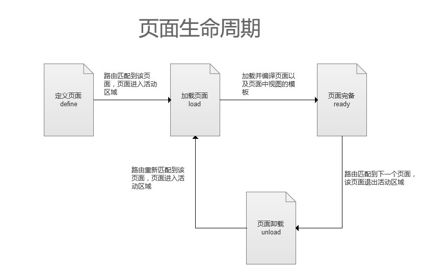

# 开发者向导

## 索引

1. 简介

	1.1 什么是解决方案？  
	1.2 为什么是解决方案？  
	1.3 解决了哪些问题？  
	1.4 有哪些主要的特性？  

2. 结构

	2.1 导航  
	2.2 状态  
	2.3 视图  
	2.4 页面  

3. 配置

4. 导航

	4.1 导航栏  
	4.2 导航操作

5. 视图

	5.1 扩展视图  
	5.2 获取视图  
	5.3 使用模板  
	5.4 使用插件  

6. 页面

	7.1 定义页面  
	7.2 获取页面  
	7.3 设置导航  
	7.4 使用路由  
	7.5 使用模板    
	7.6 使用插件   
	7.7 生命周期  

7. 状态 

8. 模型

9. 手势

10. 滚动  

11. 转场

12. 插件

## 简介

### 什么是解决方案？

解决方案`Solution`就是针对某些已经体现出的，或者可以预期的问题，不足，缺陷，需求等等，所提出的一个解决问题的方案（建议书、计划表），同时能够确保加以有效的执行（来自于[百度百科](http://baike.baidu.com/view/1038216.htm)）。

**Mix的解决方案，就是针对WebApp/OPOA的统一解决方案。**

### 为什么是解决方案？

和框架相比，解决方案会针对特定的场景或应用来给出相应的技术方案或者特性支持。目前业界的框架，都会专一于某个领域的问题，比如MVC框架（Backbone、AngularJS、EmberJS）、底层兼容性框架（jQuery、Zepto、jQ.Mobi）、模版引擎（JSTemplate，Mustache）、特性增强（iScroll）。在这些框架基础上，开发者如果要开发应用，仍需耗费一定精力，来巧妙的组合它们。而解决方案，帮组开发者完成了“组合”的工作。

Mix解决方案，是针对WebApp的统一解决方案。它能帮组开发者快速开发应用，把精力集中于业务逻辑，而少关心WebApp的各种特性。它不仅解决了组合各种框架的难题，而且，还让这种组合能随不同开发者的喜好，低耦合的来选取不同的元素。

### 解决了哪些问题？

1. 全局导航
2. 生命周期
3. 转场效果
4. 触摸手势
5. 页面滚动

### 有哪些主要的特性？

1. 只需用业务代码，即可轻松搭建WebApp。
2. 灵活的插件机制，易于二次开发，扩展业务功能。
3. 对第三方框架友好，不强奸开发者喜好。
4. 为各平台提供统一方案，保证兼容性。

## 结构

### 导航

Mix的导航，实际上包括两个概念，一个是`导航栏`，一个是`导航操作`。

**导航栏**

导航栏（NavigationBar）负责提供后退操作（左侧按钮）、标题显示、自定义操作（右侧按钮）。在页面中可以变更标题和按钮。

**导航操作**

导航操作（Navigation）可分为前进和后退。

### 状态

状态(state)对象包含了每次导航操作的所有相关属性。其中包括路由值、路由参数、GET数据、POST数据等。另外，你也可以向状态对象中储存关键数据来保证在前进/后退时数据不丢失。

### 视图

视图（View）是数据/模板的最小单位。它可以被用于创建组件或片段，例如翻页组件、列表片段等。视图可以互相组合、嵌套来完成更加复杂的视图。视图之间，用API互调的方式通信。

### 页面

页面（Page），是路由响应的入口。它占据整个活动区域，呈现内容并提供交互。每个页面中可包含多个视图。每一次导航操作，会让当前页面退出视图区域，让下一个页面进入视图区域。

## 配置

**app.config**

这个命名空间提供基础的配置项，用于开启/关闭功能或设置代理方法。所有配置必须在启动应用前完成。配置项如下：

**viewport**

	app.config.viewport = [HTMLElement];

设置视图区域节点。默认会选择`class`为`viewport`节点。

**enableContent**

	app.config.enableContent = [object]

`wrapEl`字段设置内容区域节点。默认会选择viewport下`class`为`content`的节点。`cacheLength`字段设置内容区域的页面缓存数量，默认为`5`。

**enableNavbar**

	app.config.enableNavbar = [boolean]|[object]

开启/关闭导航栏。在一些特殊场景下，可能需要关闭导航栏（比如客户端内嵌App），只需要设置false。无法在应用运行期间执行开启/关闭操作。

**enableToolbar**

	app.config.enableToolbar = [boolean]|[object]

开启/关闭工具栏。开启工具栏后，在页面中，可以对工具栏进行设置和操作（显示/隐藏）。无法在应用运行期间执行开启/关闭操作。

**enableScroll**

	app.config.enableScroll = [boolean]

开启/关闭页面滚动。无法在应用运行期间执行开启/关闭操作。

**enableTransition**

	app.config.enableTransition = [boolean]

开启/关闭转场效果。无法在应用运行期间执行开启/关闭操作。

**templateEngine**

	app.config.templateEngine = {
		load : function(url, callback) {
			// TODO load template string
			$.get(url, callback);
		},
		/**
		 * @param {string} text
		 * @return a compiled function
		 */
		compile : function(text) {
			// TODO compile;
			return Mustache.compile(text);
		},
		/**
		 * @param {object} compiled
		 * @param {object} data
		 * @return a renderd string
		 */
		render : function(compiled, data) {
			// TODO render
			return compiled(data);
		}
	}

配置模板引擎的代理方法`load`，`compile`和`render`。

##导航

### 导航栏

导航栏可分为3个部分，左侧的后退按钮，中间的标题，和右侧的自定义按钮（可多个）。

除了在页面中配置导航栏外，还可以通过调用API来修改导航栏，具体方法可以参看下面 **导航操作**以及**定义页面** 部分。

### 导航操作

**app.config.enableNavbar**

开启/关闭顶部导航栏

**app.config.enableToolbar**

开启/关闭底部工具栏

**app.navigation**

以下是一些主要方法的说明，更多方法请详见[API参考](api.md)

**push**

前进操作。当`push`方法参数为空时，为**进入下一个页面**，等同于`history.forward`；当`push`方法指定参数时，为**导航到指定页面**，等同于`location.hash='#xxx'`。

**pop**

`pop`方法，无需参数，为**后退到上一个页面**，等同于`history.back`。

以上操作同浏览器的前进/后退的行为保持一致。例如：

	app.navigation.push('hello/world', // 路由值
	{// 第二个参数可选
		type : 'GET'
		data : {content:'a long text'}	
	});

以上操作，会使得hash值变为`#hello/wolrd!content=a long text`。

**getParameter**

获得路由中的参数值。例如：

	app.navigation.getParameter('name') //路由为hello/(P<name>.+)

**setTitle**

设置导航栏标题。例如：

	app.navigation.setTitle('商品详情') // text  
	app.navigation.setTitle('<input type="text">') // html

**setButton**

设置导航栏按钮。例如：

	app.navigation.setButton({	// 所有属性
		type: 'back',		// 返回按钮为back，功能按钮为func
		id: 'btn1',			// 设置id
		class: 'btn',		// 设置className
		text: 'back',		// 设置按钮文本
		bg: '#FFF',			// 设置background
		icon: 'icon.png',	// 设置按钮内的图标，text和icon只能选其一
		hide: false,		// 是否隐藏
		handler: function() {}	//点击事件句柄
	})

	app.navigation.setButton({	// 隐藏id为btn1的按钮
		id: 'btn1',
		hide: true
	})

	app.navigation.setButton({	// 增加一个功能按钮
		type: 'func',
		text: 'close'
	})

**setToolbar**

设置工具栏内容。例如：

	app.navigation.setToolbar({
		html: '
Copyright
', // html
		height: 50
	});

	app.navigation.setToolbar({
		el: document.createElement('div'), // HTMLElement
		height: 50
	})
	

## 视图

视图是数据/模板的最小集合。

### 扩展视图

**app.extendView(properties)**

扩展View，返回View的一个子类。例如：

	app.extendView({
		name: 'list',
		el: 'ul',

		render : function() {
			// 重载View的render方法
			var html = '';
			for (var i = 0; i < 10; i++) {
				html += '<li>' + i + '</li>';
			}
			this.el.innerHTML = html;
		},

		destory: function(){
			// 重载View的destory方法
		}
	});

其中：

- name，视图名，全局唯一。
- el，视图的外层节点（只读），支持类似zenCoding的方式来生成dom。例如'div#search.list > ul'，将会生成`
<ul></ul>
`。目前支持`tag`,`id`,`class`和`child`语法。
- $el，如在js的全局作用域中存在`$`函数，则该属性为调用`$(el)`后的结果（只读）。
- render()，重载了View的render方法，渲染视图都必须调用此方法。
- destory()，重载了View的destory方法，销毁视图都必须调用此方法。

### 获取视图

**app.getView(name)**

获取该视图的一个实例。

### 使用模板

在视图中，可以用模板来渲染数据。使用模板之前，必须在配置中给出模板引擎的代理方法（详见`app.config.templateEngine`）。

通过`template`字段提供模板文本、模板文件地址或者渲染函数：

	app.extendView({
		name: 'list',
		el: 'ul',
		template: '<li>{{i}}<li>',	// 模板文本

		render : function() {
			var html = '';
			for (var i = 0; i < 10; i++) {
				html += this.template({i:i});
			}
			this.el.innerHTML = html;
		}
	});

在上面的例子中，`template`字段是一个模板文本，在`render`中，template字段被编译成一个渲染函数。同时，`template`字段也可以是一个后缀为`tpl`的url地址：

	app.extendView({
		name: 'list',
		el: 'ul',
		template: './list.tpl',	// 模板文件地址

		render : function() {
			var html = '';
			for (var i = 0; i < 10; i++) {
				html += this.template({i:i});
			}
			this.el.innerHTML = html;
		}
	});

`template`字段还支持多模板的形式，例如：

	app.extendView({
		name: 'list',
		el: 'ul',
		template: {
			nice: './nicelist.tpl'， // 文本或地址
			bad: './badlist.tpl'
		},	// 模板文件地址

		render : function(type) {
			var html = '';
			for (var i = 0; i < 10; i++) {
				html += this.template[type]({i:i});
			}
			this.el.innerHTML = html;
		}
	});

### 使用插件

插件，是二次开发的一个切入口。在视图中，通过在`plugins`字段下开启相应的插件，就可以使用了。例如：

	app.extendView({
		name: 'list',
		el: 'ul',
		template: './list.tpl',
		plugins: {
			domevent: true	// 开启domevent插件
		},

		render : function() {
			var html = '';
			for (var i = 0; i < 10; i++) {
				html += this.template({i:i});
			}
			this.el.innerHTML = html;
		}
	});

每个插件，都有不同的行为，具体可查看[插件](plugin.md)一章。

## 页面

页面，是一个完整的功能集合。同时，它是全局单例的。

### 定义页面

**app.definePage(properties)**

定义一个页面，并返回该页面的实例。例如：

	app.definePage({
		name: 'helloworld',	

		startup: function() {
			// 重载startup方法
			this.html('<h1>hello world</h1>

');
			console.log(this.el.innerHTML);
		},

		show: function() {
			// 重载show方法
			this.el.querySelector('p').innerHTML = new Date().toString();
		},

		hide: function() {
			// 重载hide方法
		},

		teardown: function() {
			// 重载teardown方法
		}
	});

- name，页面名，全局唯一。
- el，页面内容节点（只读）。
- $el，如在js的全局作用域中存在`$`函数，则该属性为调用`$(el)`后的结果（只读）。
- html()，设置页面内容节点的HTML。
- startup()，重载了父类的startup方法，页面进入的入口。
- show()，重载了父类的show方法，页面在缓存中时，显示的入口
- hide()，重载了父类的show方法，页面在缓存中时，隐藏的入口
- teardown()，重载了父类的teardown方法，页面退出的入口。

以上是最简单的一段页面定义，在`startup`入口函数中输出`hello world`。关于`startup`，`show`，`hide`，`teardown`四个方法的执行顺序，请参看页面的`生命周期`。

### 获取页面

**app.getPage(name)**

返回该页面的唯一实例。

### 设置导航

在页面进入`startup`前，可以预先对导航栏以及工具栏进行设置。

	app.definePage({
		name: 'helloworld',	
		title: 'Hello Demo'	// 导航栏标题
		buttons: [	// 导航按钮
			{type:'back', text:'返回'},
			{type:'func, text:'关闭'},
			{type:'func, text:'刷新'}
		]，
		toolbar: {	// 工具栏
			height: 50,
			html: 'copryright'
		},

		startup: function() {
			// 重载startup方法
			this.html('<h1>hello world</h1>');
		},

		teardown: function() {
			// 重载teardown方法
		}
	});

这些设置是只读的，在`startup`之后改变这些设置不会影响导航栏和工具栏的状态。如果需要在`startup`之后改变状态，可以调用`app.navigation`中的接口。

### 使用路由

路由是系统链接页面的一个桥梁，也是页面与页面链接的桥梁。页面配置路由后，可以通过访问不同的Hash片段来访问不同的页面。

	app.definePage({
		name: 'helloworld',	
		route: 'hello\\/(P<name>.+)',

		startup: function() {
			// 重载startup方法
			var name = app.navigation.getParameter('name');
			this.html('<h1>hello ' + name + '</h1>');
		},

		teardown: function() {
			// 重载teardown方法
		}
	});

上述代码通过`route`字段给页面定义了一个路由。路由的文本是一个正则表达式字符串，必须对正则中的关键字符进行转义。同时，扩展了JS的正则语法，使其能支持参数表达式（Perl风格）。并可以借由`app.navigation.getParameter(name)`来获取路由中定义的参数值。

### 使用模板

同`5. 视图 > 5.3 使用模板`

### 使用插件

同`5. 视图 > 5.4 使用插件`

### 生命周期

## 状态

状态实际上是每个页面在不同请求下的一个相关数据集合。例如，上述`helloworld`页面，当Hash片段为`hello/zhuxun`以及`hello/hanquan`时，就拥有不同的两个状态。这两个状态分别承载了不同的数据。包括，参数值集合，状态在历史堆栈中的位置，是经由前进或后退达到的，等等。所以说，每个页面实际上会存在多个状态，对应着多个不同的请求（Hash片段）。

所有针对状态的操作，都封装在`app.navigation`中，调用其中的API均是操作当前页面的当前状态。处于安全性和封闭性考虑，开发者无法获得除当前状态以外的状态。如果想和下个一个状态进行通信，只能通过`app.navigation.push`传递参数的方式进行。

## 模型

模型分为单模型和集合模型，并提供监听属性改变的事件。

**app.module.Model**

单模型。使用举例：

	var user = {
			name:'zhuxun', 
			level:5,
			trophy: {
				newbee: false,
				ace: false
			}
		},
		userModel = new app.module.Model(user);

	userModel.on('propertyChange', function(e) {
		console.log(e);
	});

	userModel.level = 6;
	userModel.trophy.newbee = true;
	userModel.trophy.ace = true;

上述代码中，userModel是user对象的一个代理模型。对userModel中属性值的改变会对应到user中。当监听代理模型的`propertyChange`时，可以获得属性改变时的状态`e`，它包括如下一些字段：

	name: 属性名
	value: 改变后的属性值
	target: 该属性所在的对象
	path: 该属性的路径

例如，改变`userModel.trophy.ace = true`后，监听到事件的`e`为:

	{
		name: 'ace',
		value: true,
		target: [object] // userModel.trophy
		path: 'trophy.ace'
	}

还可以监听指定的路径
	
	userModel.on('change:tropy.ace', function(value) {
		console.log(value);
	});

**注意**： 用表达式只能访问和修改属性。如需新增属性，需要调用`update`方法。更多方法请参考[API文档](api.md)。

**app.module.Collection**

集合模型。使用举例：

	var list = [a,b,c,d,{v:'e'}],
		listModel = new app.module.Collection(list)
		;

	listModel.on('propertyChange', function(e) {
		console.log(e);
	});

	listModel.push('f');
	listModel[4].v = 'ee';
	listModel[5] = 'ff';
	listModel.pop(); 

监听到的`e`同单模型。也同样可以监听指定属性，比如`change:4.v`。

## 手势

**app.module.Gesture**

当包含这个系统模块时，所有HTML元素都都可以监听手势事件。手势事件包括：

- tap 轻击
- doubletap 快速双击
- panstart 开始平移
- horizontalpanstart 开始水平平移
- verticalpanstart 开始垂直平移
- pan 平移中
- horizontalpan 水平平移中
- verticalpan 垂直平移中
- panend 平移结束
- flick 轻弹
- horizontalflick 水平轻弹
- verticalflick 垂直轻弹
- press 长按
- pressend 长按结束

## 滚动  

滚动是指内容区域的滚动（非原生浏览器的滚动）。目前暂时只支持Y轴的滚动。

**app.module.Scroll**

	app.module.Scroll.enable(element);

调用`enable`方法，就可以使`element`元素中的内容支持Y轴滚动。同时此模块有众多方法来获取滚动时的状态，具体请参看[API文档](api.md)。

整个页面区域的滚动可通过`app.config.enableScroll`来开启或关闭。`app.scroll`中提供的方法是针对整个页面区域的。并且会针对关闭滚动的情况进行适配。具体请参看[API文档](api.md)。

## 转场

可通过`app.config.enableTransition`来开启或关闭转场动画。在调用`app.navigation.push`时，默认为`forward`的转场动画，但可以通过`transition`参数指定为`backward`。例如：

	app.navigation.push('list', {transition:'backward'});

此外，通过调用`app.module.Transition`提供的方法，可以获得预设的几种转场效果。具体请参看[API文档](api.md)。

## 插件

插件是二次开发的切入口。适合高级用户来对系统进行扩展。插件的使用主要分为几个场景：

- 应用场景。应用启动时，转场时等
- 页面场景。页面定义时，页面进入时等
- 视图场景。视图扩展时，视图渲染时等

在`app.plugin`中提供了自定义的插件。详细内容请移步[插件文档](plugin.md)

